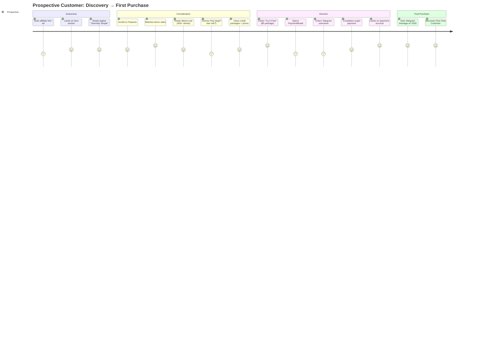
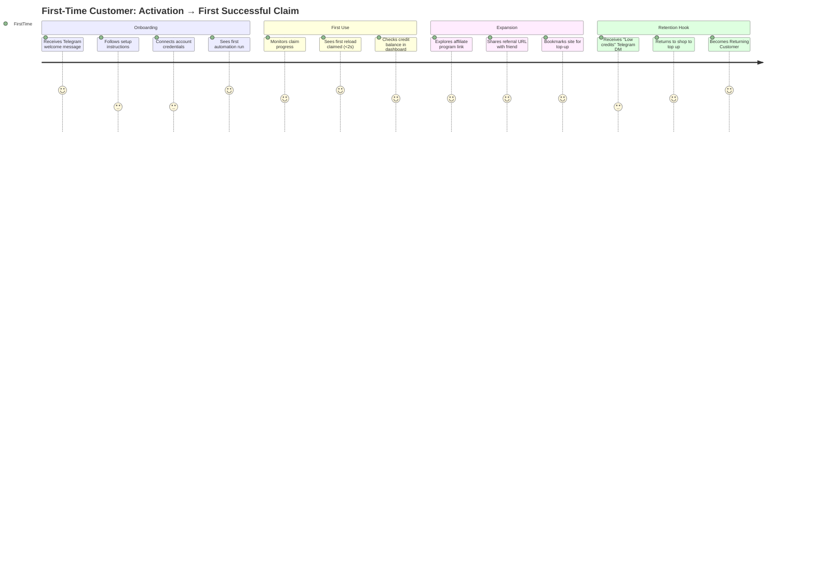
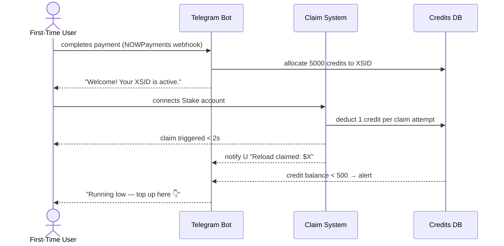
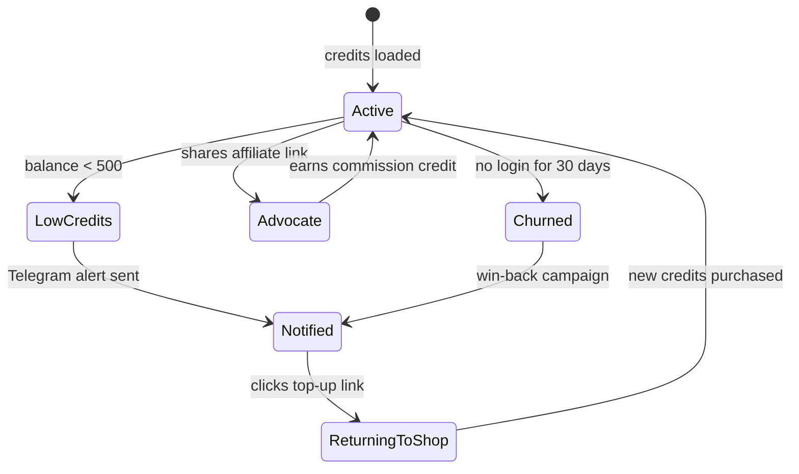
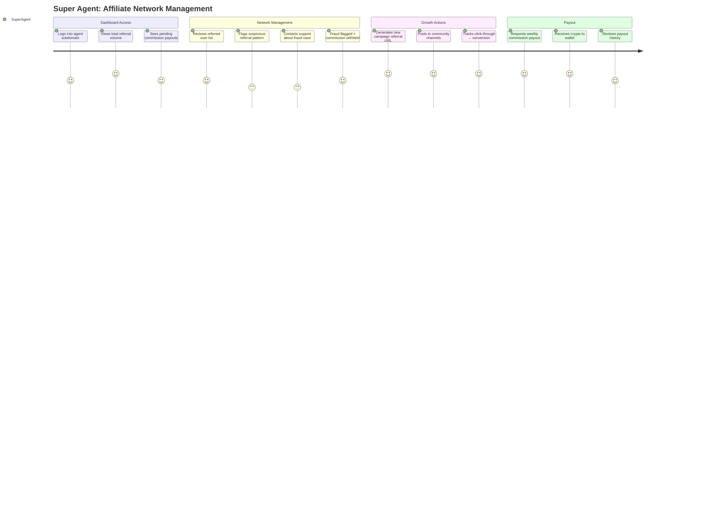
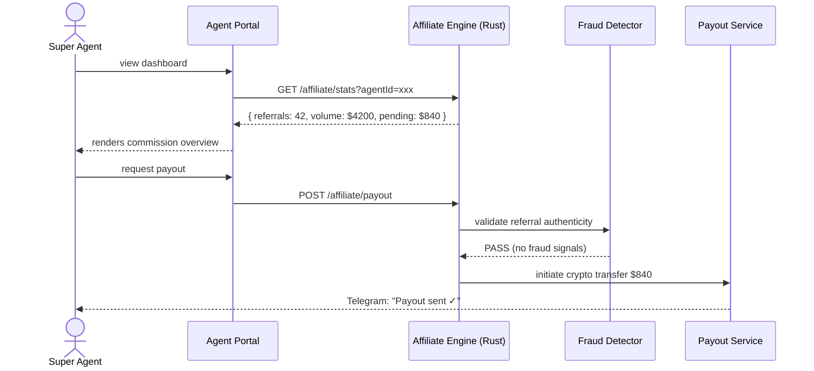
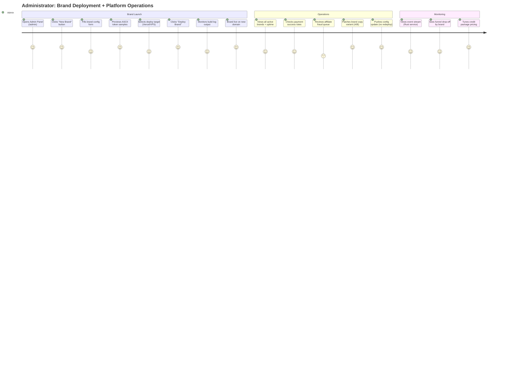
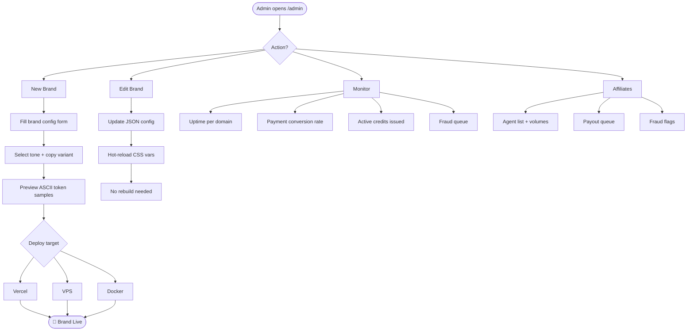
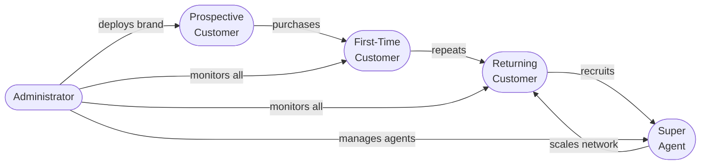

# Fused Gaming — User Journey Maps

Five distinct personas interact with the platform at very different depths.
Each journey is mapped below as a Mermaid flowchart, followed by a state diagram
showing the emotional arc, then a sequence diagram for the critical path.

---

## Persona Definitions

| # | Persona | Entry Point | Goal | Key Fear |
|---|---------|-------------|------|----------|
| 1 | **Prospective Customer** | Affiliate link / social | Understand the offer | Scam / account ban |
| 2 | **First-Time Customer** | Direct purchase | Activate credits, see first claim | Setup complexity |
| 3 | **Returning Customer** | Bookmark / Telegram reminder | Top up, check stats, re-claim | Credits running out |
| 4 | **Super Agent** | Admin subdomain | Manage affiliate network, view volumes | Fraud, bad actors |
| 5 | **Administrator** | Internal admin panel | Deploy brands, configure tokens, monitor all | System instability |

---

## 1. Prospective Customer Journey

```mermaid
stateDiagram-v2
  direction LR
  [*] --> Skeptical : arrives via affiliate link
  Skeptical --> Curious : hero + stats land
  Curious --> Interested : demo video watched
  Interested --> Hesitant : sees payment required
  Hesitant --> Convinced : FAQ resolves ban concern
  Convinced --> Converting : clicks package
  Converting --> Purchased : payment complete
  Purchased --> [*] : Telegram confirmation received
```





---

## 2. First-Time Customer Journey





---

## 3. Returning Customer Journey

```mermaid
journey
  title Returning Customer: Re-engagement → Ongoing Value Loop
  section Re-entry
    Receives Telegram low-credit alert: 4: Returning
    Opens site from bookmark:           4: Returning
    Skips hero (already knows it):      5: Returning
  section Top-Up
    Goes directly to #shop:             5: Returning
    Selects larger package (more value):5: Returning
    Opens PaymentModal:                 4: Returning
    Pre-filled Telegram from memory:    5: Returning
    Completes payment quickly:          5: Returning
  section Loyalty Loop
    Checks affiliate earnings:          4: Returning
    Sees compounding commission:        5: Returning
    Shares link to earn more:           5: Returning
    Credits replenished, loop restarts: 5: Returning
```



---

## 4. Super Agent Journey





---

## 5. Administrator Journey





---

## Cross-Persona Funnel Overlap


